# Documentation of Project 7

## Step 1: Prepare NFS Server
1. Spin up a new EC2 instance with RHEL Linux 8 Operating System.

2. Based on your LVM experience from Project 6, Configure LVM on the Server.
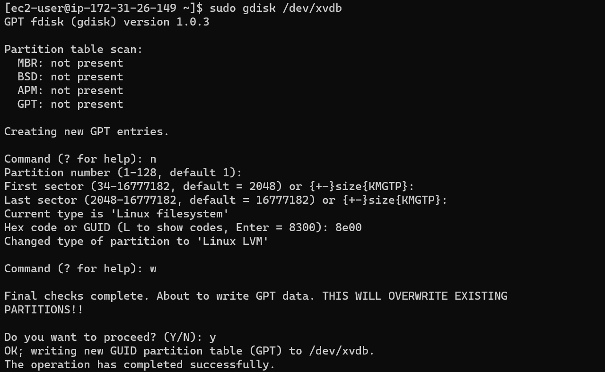

a. Instead of formating the disks as ext4 you will have to format them as xfs

b. Ensure there are 3 Logical Volumes. lv-opt lv-apps, and lv-logs
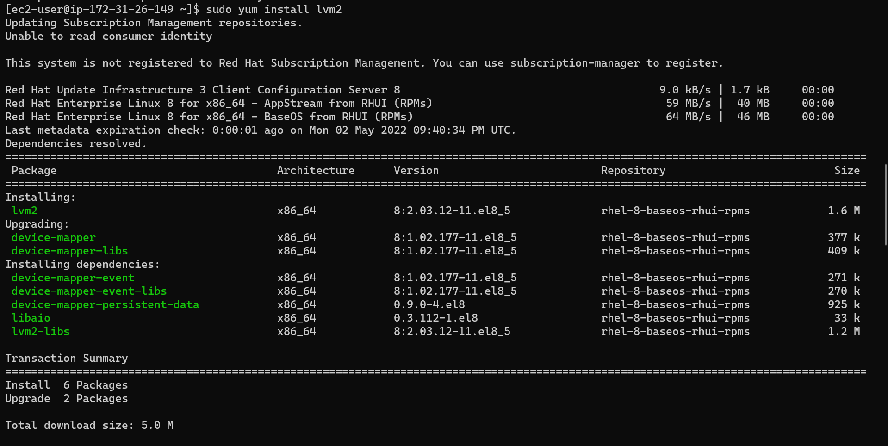
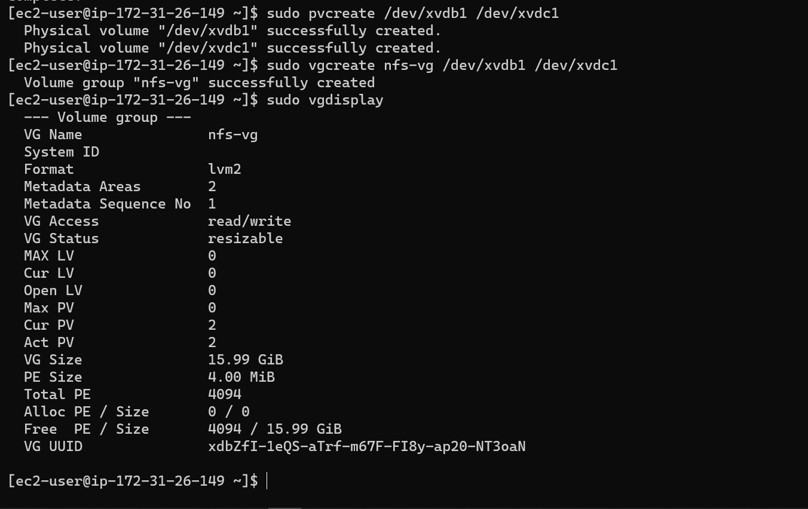
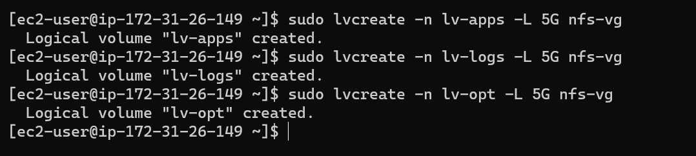
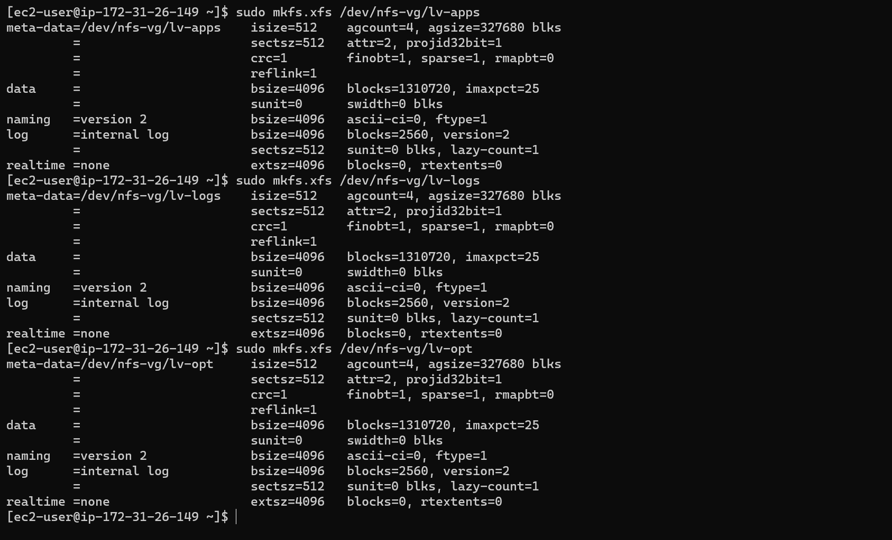

c. Create mount points on /mnt directory for the logical volumes as follows:

- Mount lv-apps on /mnt/apps – To be used by webservers
- Mount lv-logs on /mnt/logs – To be used by webserver logs
- Mount lv-opt on /mnt/opt – To be used by Jenkins server in Project 8
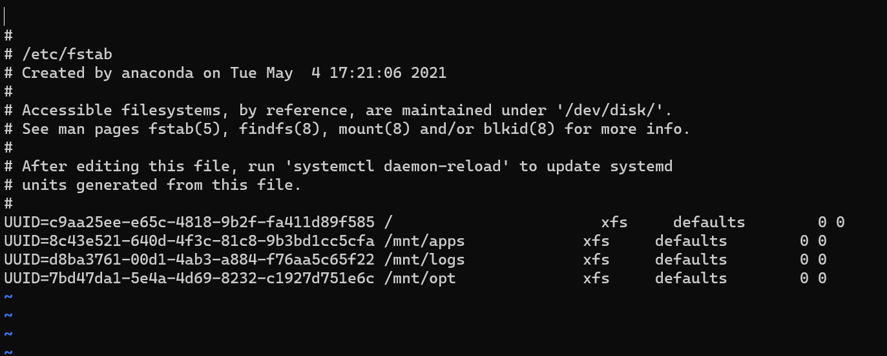
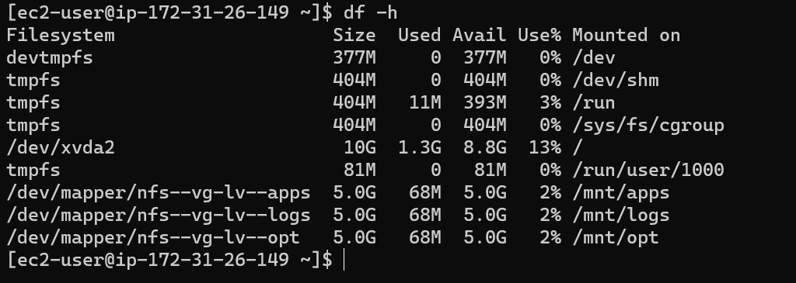

3. Install NFS server, configure it to start on reboot and make sure it is u and running

`sudo yum -y update`

`sudo yum install nfs-utils -y`

`sudo systemctl start nfs-server.service`

`sudo systemctl enable nfs-server.service`

`sudo systemctl status nfs-server.service`

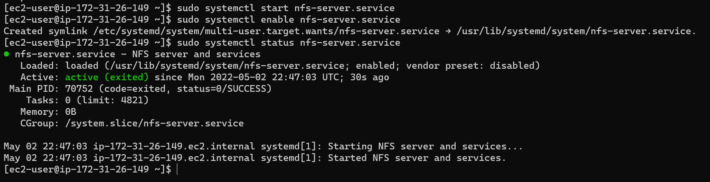

4. Export the mounts for webservers’ subnet cidr to connect as clients. For simplicity, you will install your all three Web Servers inside the same subnet, but in production set up you would probably want to separate each tier inside its own subnet for higher level of security.

5. To check your subnet cidr – open your EC2 details in AWS web console and locate ‘Networking’ tab and open a Subnet link:

6. Make sure we set up permission that will allow our Web servers to read, write and execute files on NFS:

`sudo chown -R nobody: /mnt/apps`

`sudo chown -R nobody: /mnt/logs`

`sudo chown -R nobody: /mnt/opt`

`sudo chmod -R 777 /mnt/apps`

`sudo chmod -R 777 /mnt/logs`

`sudo chmod -R 777 /mnt/opt`

`sudo systemctl restart nfs-server.service`

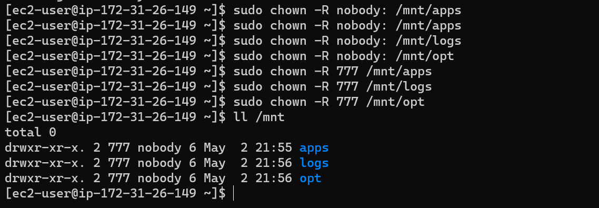

7. Configure access to NFS for clients within the same subnet (example of Subnet CIDR – 172.31.32.0/20 ): `sudo vi /etc/exports`. Edit with:

`/mnt/apps < Subnet-CIDR >(rw,sync,no_all_squash,no_root_squash)`

`/mnt/logs < Subnet-CIDR >(rw,sync,no_all_squash,no_root_squash)`

`/mnt/opt < Subnet-CIDR >(rw,sync,no_all_squash,no_root_squash)`

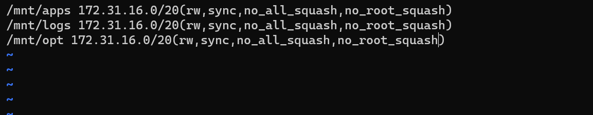

Run `sudo exportfs -arv`

8. Check which port is used by NFS and open it using Security Groups (add new Inbound Rule): `rpcinfo -p | grep nfs`
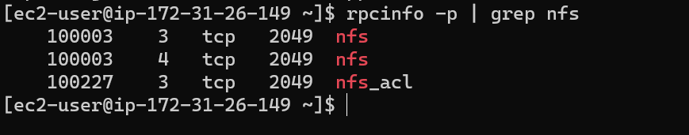

9. Important note: In order for NFS server to be accessible from your client, you must also open following ports: TCP 111, UDP 111, UDP 2049, and TCP 2049
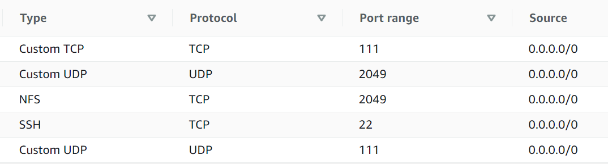

## Step 2: Configure the Database Server

1. Install MySQL server
2. Create a database and name it tooling
3. Create a database user and name it webaccess
4. Grant permission to webaccess user on tooling database to do anything only from the webservers subnet cidr

## Step 3: Prepare the Web Servers
1. Launch a new EC2 instance with RHEL 8 Operating System

2. Install NFS client: `sudo yum install nfs-utils nfs4-acl-tools -y`

3. Mount /var/www/ and target the NFS server’s export for apps: `sudo mkdir /var/www
sudo mount -t nfs -o rw,nosuid < NFS-Server-Private-IP-Address >:/mnt/apps /var/www`

4. Verify that NFS was mounted successfully by running df -h. Make sure that the changes will persist on Web Server after reboot: `sudo vi /etc/fstab`

Add line: `<NFS-Server-Private-IP-Address>:/mnt/apps /var/www nfs defaults 0 0`

5. Install Remi’s repository, Apache and PHP: `sudo yum install httpd -y`

`sudo dnf install https://dl.fedoraproject.org/pub/epel/epel-release-latest-8.noarch.rpm`

`sudo dnf install dnf-utils http://rpms.remirepo.net/enterprise/remi-release-8.rpm`

`sudo dnf module reset php`

`sudo dnf module enable php:remi-7.4`

`sudo dnf install php php-opcache php-gd php-curl php-mysqlnd`

`sudo systemctl start php-fpm`

`sudo systemctl enable php-fpm`

`setsebool -P httpd_execmem 1`

6. Repeat steps 1-5 for another 2 Web Servers.

7. Verify that Apache files and directories are available on the Web Server in /var/www and also on the NFS server in /mnt/apps. If you see the same files – it means NFS is mounted correctly. You can try to create a new file touch test.txt from one server and check if the same file is accessible from other Web Servers.
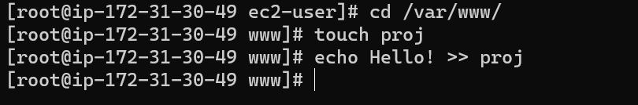
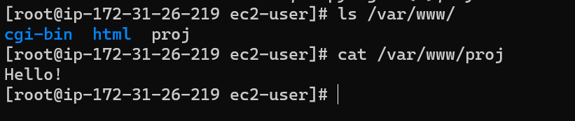

8. Locate the log folder for Apache on the Web Server and mount it to NFS server’s export for logs. Repeat step №4 to make sure the mount point will persist after reboot.

9. Fork the tooling source code from Darey.io Github Account to your Github account.
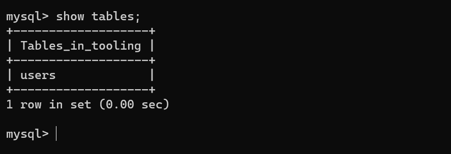
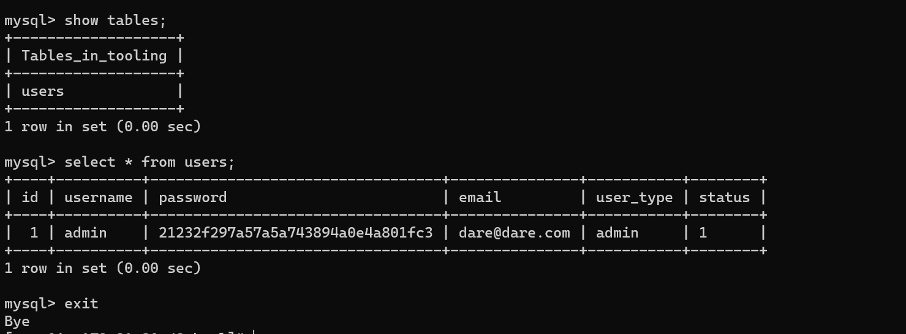

10. Deploy the tooling website’s code to the Webserver. Ensure that the html folder from the repository is deployed to /var/www/html

Note 1: Do not forget to open TCP port 80 on the Web Server.

Note 2: If you encounter 403 Error – check permissions to your /var/www/html folder and also disable SELinux sudo setenforce 0. To make this change permanent – open following config file sudo vi /etc/sysconfig/selinux and set SELINUX=disabledthen restrt httpd.
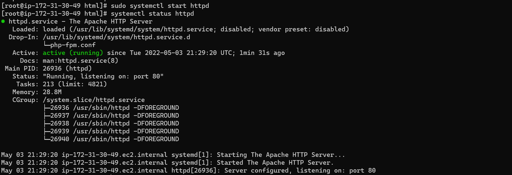
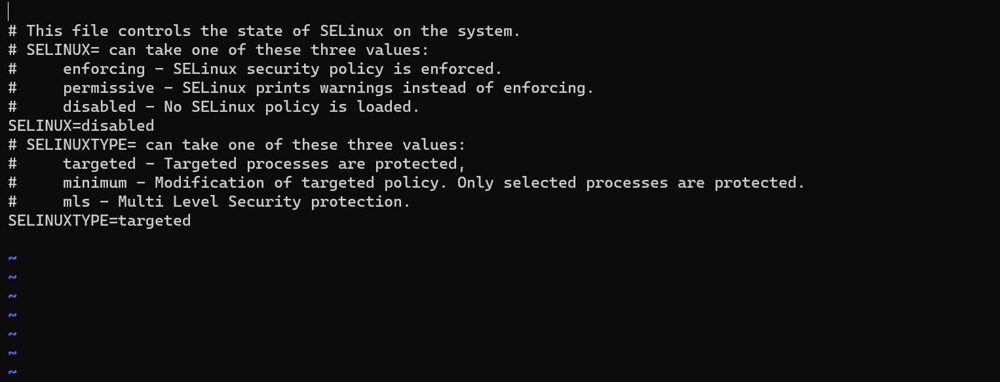

11. Update the website’s configuration to connect to the database (in /var/www/html/functions.php file). Apply tooling-db.sql script to your database using this command mysql -h < databse-private-ip > -u < db-username > -p < db-pasword > < tooling-db.sql
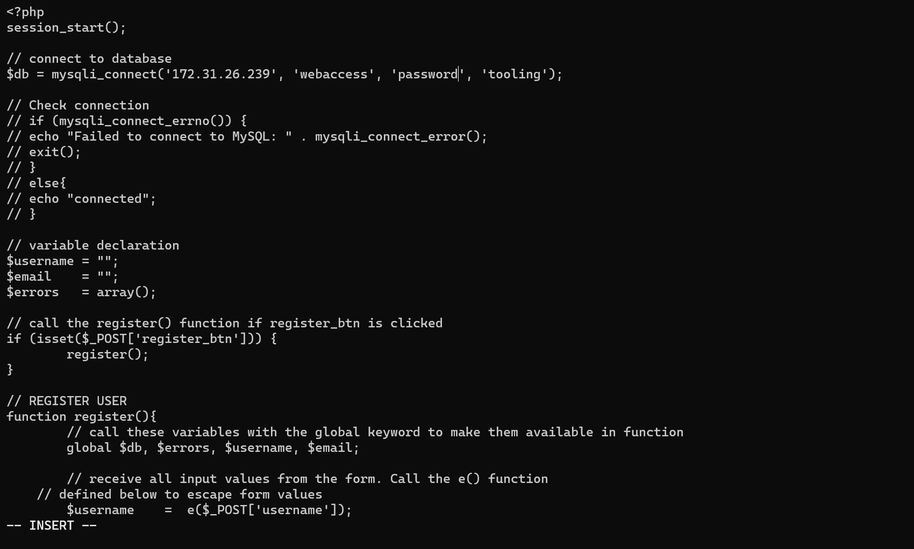

12. Create in MySQL a new admin user with username: myuser and password: password:

`INSERT INTO ‘users’ (‘id’, ‘username’, ‘password’, ’email’, ‘user_type’, ‘status’) VALUES
-> (1, ‘myuser’, ‘5f4dcc3b5aa765d61d8327deb882cf99’, ‘user@mail.com’, ‘admin’, ‘1’);`

13. Open the website in your browser http://< Web-Server-Public-IP-Address-or-Public-DNS-Name >/index.php and make sure you can login into the website with myuser user.
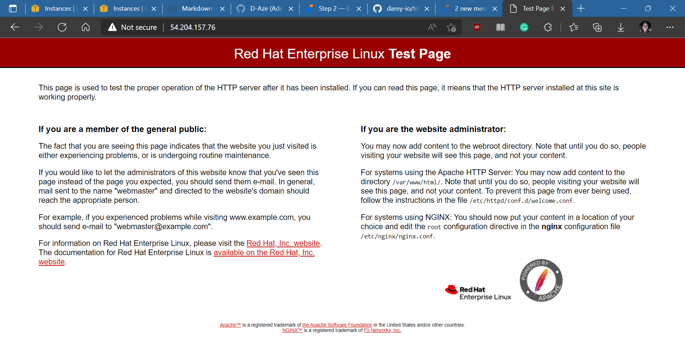
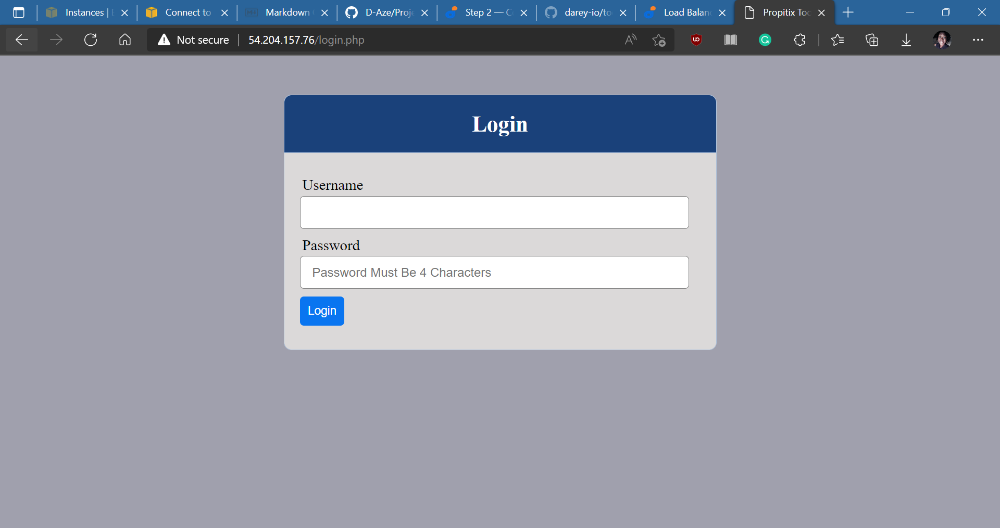

For steps, 2-5, you can run this in 
#!/bin/bash

sudo yum install nfs-utils nfs4-acl-tools -y

sudo mkdir /var/www

sudo mount -t nfs -o rw,nosuid 172.31.26.149:/mnt/apps /var/www

sudo echo "172.31.26.149:/mnt/apps /var/www    nfs         defaults       0 0" >> /etc/fstab

sudo yum install httpd -y

sudo dnf install https://dl.fedoraproject.org/pub/epel/epel-release-latest-8.noarch.rpm -y

sudo dnf install dnf-utils http://rpms.remirepo.net/enterprise/remi-release-8.rpm -y

sudo dnf module reset php -y

sudo dnf module enable php:remi-7.4 -y

sudo dnf install php php-opcache php-gd php-curl php-mysqlnd -y

sudo systemctl start php-fpm

sudo systemctl enable php-fpm

setsebool -P httpd_execmem 1

