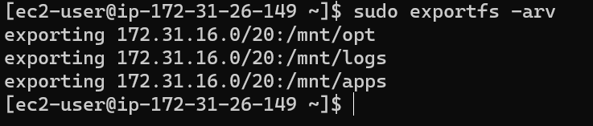

# Documentation of Project 7

## Step 1: Prepare NFS Server
1. Spin up a new EC2 instance with RHEL Linux 8 Operating System.

2. Based on your LVM experience from Project 6, Configure LVM on the Server.

a. Instead of formating the disks as ext4 you will have to format them as xfs

b. Ensure there are 3 Logical Volumes. lv-opt lv-apps, and lv-logs

c. Create mount points on /mnt directory for the logical volumes as follows:

- Mount lv-apps on /mnt/apps – To be used by webservers
- Mount lv-logs on /mnt/logs – To be used by webserver logs
- Mount lv-opt on /mnt/opt – To be used by Jenkins server in Project 8

3. Install NFS server, configure it to start on reboot and make sure it is u and running

`sudo yum -y update`

`sudo yum install nfs-utils -y`

`sudo systemctl start nfs-server.service`

`sudo systemctl enable nfs-server.service`

`sudo systemctl status nfs-server.service`

4. Export the mounts for webservers’ subnet cidr to connect as clients. For simplicity, you will install your all three Web Servers inside the same subnet, but in production set up you would probably want to separate each tier inside its own subnet for higher level of security.

5. To check your subnet cidr – open your EC2 details in AWS web console and locate ‘Networking’ tab and open a Subnet link:

6. Make sure we set up permission that will allow our Web servers to read, write and execute files on NFS:

`sudo chown -R nobody: /mnt/apps`

`sudo chown -R nobody: /mnt/logs`

`sudo chown -R nobody: /mnt/opt`

`sudo chmod -R 777 /mnt/apps`

`sudo chmod -R 777 /mnt/logs`

`sudo chmod -R 777 /mnt/opt`

`sudo systemctl restart nfs-server.service`

7. Configure access to NFS for clients within the same subnet (example of Subnet CIDR – 172.31.32.0/20 ): `sudo vi /etc/exports`. Edit with:

`/mnt/apps < Subnet-CIDR >(rw,sync,no_all_squash,no_root_squash)`

`/mnt/logs < Subnet-CIDR >(rw,sync,no_all_squash,no_root_squash)`

`/mnt/opt < Subnet-CIDR >(rw,sync,no_all_squash,no_root_squash)`

Run `sudo exportfs -arv`

8. Check which port is used by NFS and open it using Security Groups (add new Inbound Rule): `rpcinfo -p | grep nfs`

9. 

